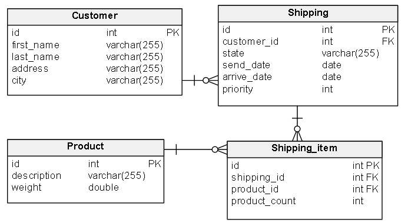
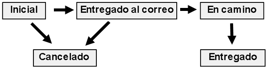

# Mareo Envíos

Marcos junto a sus amigos, cansados de las malas gestiones de las empresas de correo, se plantearon armar una empresa de envíos de mercadería a todo el país gestionadas digitalmente. Debido a la urgencia de salida al mercado, te contactaron para que le entregues WebService para que ellos puedan evolucionar con facilidad.

## Requerimientos técnicos

* __Arquitectura WS__: RESTful Json
* __Lenguaje__: Java 17
* __Formato proyecto__: maven
* __Framework__: Spring Boot
* __Base de datos__: PostgreSQL

* Incluir Dockerfile de 2 etapas para buildear con Docker
* Preparar todo el stack con docker-compose (IE: app + db)
* Utilizar archivo de variables de entorno
* Escribir tests unitarios y de integración
* Documentar la API con Swagger
* Opcional agregar métricas (jvm, http, hikari, system)

## Requerimientos funcionales

* Poder obtener información del comprador 
* Obtener listado de compradores 
* Poder obtener información del envío y detalle de productos comprados.
* Obtener listado de envíos por rango de fecha de envio con el detalle productos
* Listado de envíos por estado
* Poder cambiar el estado del envío siguiendo las siguientes reglas de negocio:
  * El estado inicial es “Inicial” y solo se puede transicionar a “Entregado al correo” y a “Cancelado”
  * El estado “Entregado al correo” solo se puede transicionar a “En camino” y a “Cancelado”
  * El estado “En camino” solo se puede transicionar a “Entregado”
  * Los estados “Entregado” y “Cancelado” son estados finales y no se pueden transicionar.
* Obtener un listado con la descripción y cantidad de los 3 productos más solicitados para su envío
* Creación de solicitud de envio (considerar nuevos compradores)

## Firmas a utilizar

* /customer/info/{customerId}
* /customer/info
* /shipping/info/{shippingId}
* /shipping/info/{sendDateFrom}/{sendDateTo}
* /shipping/info/{state}
* Firmas de transiciones:
  * /shipping/transition/sendToMail/{shippingId}
  * /shipping/transition/inTravel/{shippingId}
  * /shipping/transition/delivered/{shippingId}
  * /shipping/transition/cancelled/{shippingId}
* /reports/topSended
* /shipping/create

## Aclaraciones

* Se dejan algunos datos de ejemplo para que sea más sencillo realizar las pruebas. 
* Considerar que el volumen de datos puede crecer considerablemente
* Es necesario la creación del esquema y tablas
* Implementar manejo de errores en las respuestas de las distintas firmas.
* Utilizar cache para optimizar consultas db (Opcional utilizar redis dockerizado)
* Implementar lógica de reintentos en la transición de estados y creación de solicitud de envio (hasta 3 reintentos)
* Se incluye _pom.xml_ y codigo minimo para inicializar el proyecto.

### Esquema

### Flujo estados

### Entrega 
Se deberá entregar enlace al repositorio de GitHub o Gitlab donde se hizo el desarrollo por correo electrónico. Se tendrá en cuenta también la documentación hecha en el README y la manera en la que se trabajaron los commits
